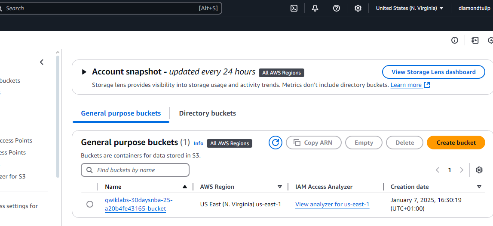

# DevOps AllStars Challenge

# Day 1: Building a Weather data collection system

## Project Overview

This project is a Weather Data Collection System that demonstrates core DevOps principles utilizing the following Technologies:

1. External API Integration (OpenWeather API)
1. Cloud Storage (AWS S3)
1. Infrastructure as Code
1. Version Control (Git)
1. Python Development
1. Error Handling
1. Environment Management

## Architecture

The application Fetches real-time weather data for OpenWeather API and Automatically stores the fetched weather data in AWS S3 bucket. The architekkk Supports multiple cities tracking as well as Timestamps all data for historical tracking

The application is a python App that integrates with AWS S3 service to scrape data from a wep API and stores the data in a cloud bucket for further analysis.

## Tools

- Python 3.x
- AWS S3 bucket
- OpenWeather API

## Python Dependencies (requirements.txt)

- `boto3==1.26.137`
- `python-dotenv==1.0.0`
- `requests==2.28.2`

## weather_dashboard.py is the main python file that will run the application

### Project Directory Structure

---

## Setup Instructions

pip install -r requirements.txt

---

### Configure environment variables (.env):

OPENWEATHER_API_KEY=your_api_key
AWS_BUCKET_NAME=your_bucket_name
---

### install and Configure AWS credentials:

- `curl "https://awscli.amazonaws.com/awscli-exe-linux-x86_64.zip" -o "awscliv2.zip"`
- `unzip awscliv2.zip`
- `sudo ./aws/install`

### Configure AWS credentials

aws configure

### Run the application:

python3 src/weather_dashboard.py

---

## Application Deployed

###

###

